

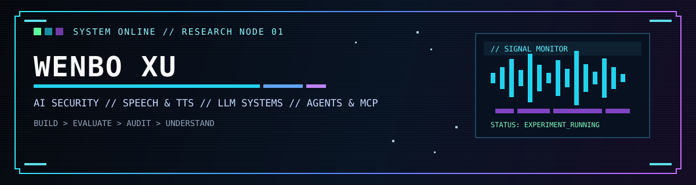

`AI Security` · `Speech / TTS` · `LLM Systems` · `Agents / MCP` · `Evaluation` · `Reproducibility`

---

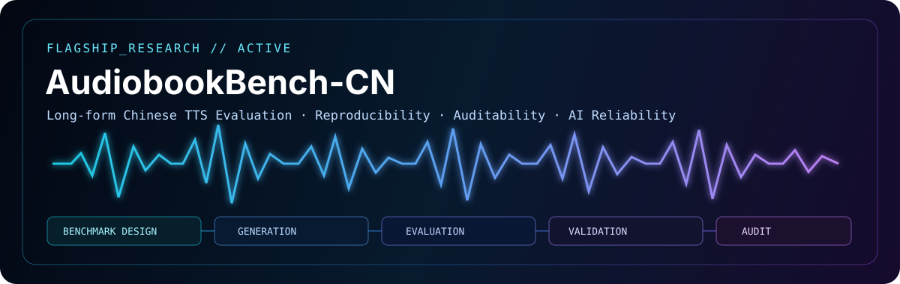

 

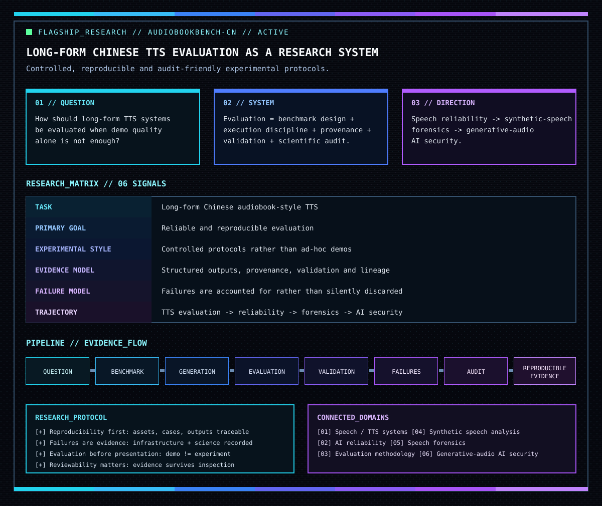

---

 

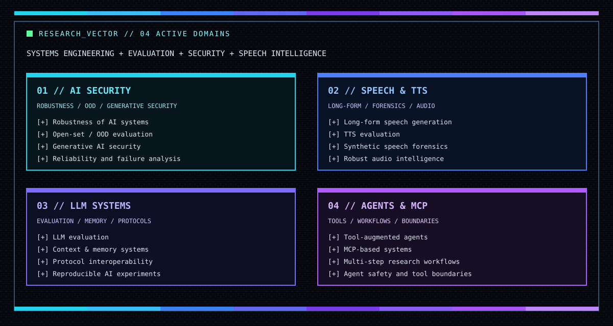

---

[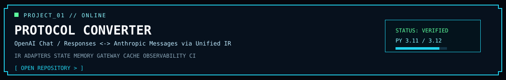](https://github.com/XuWenboooo/protocol-converter)

[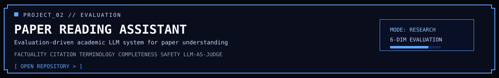](https://github.com/XuWenboooo/paper-reading-assistant)

[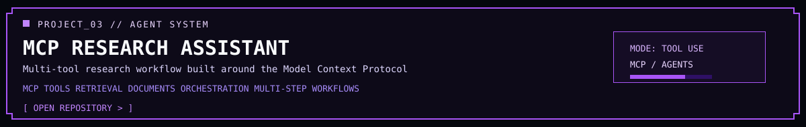](https://github.com/XuWenboooo/mcp-tool-assistant)

---

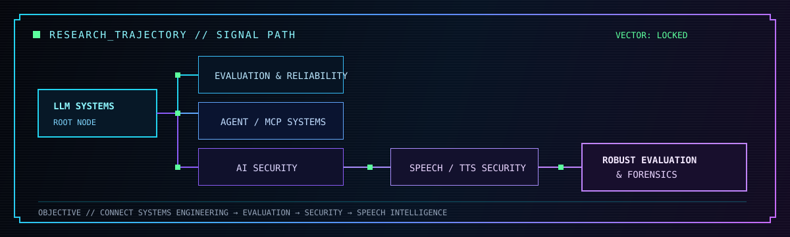

---

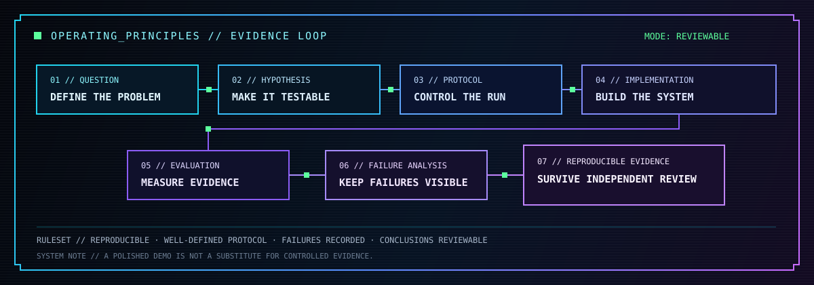

---

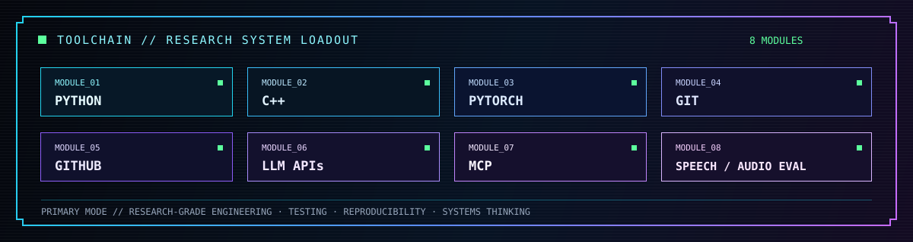

---

 

---

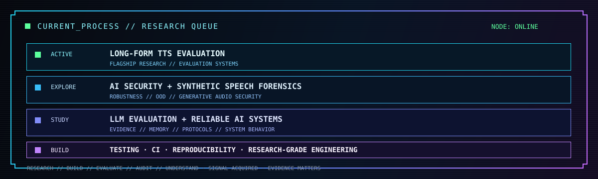

