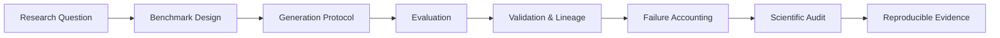

`AI Security` · `Speech / TTS` · `LLM Systems` · `Agents / MCP` · `Evaluation` · `Reproducibility`

---

## `// FLAGSHIP_RESEARCH`

> **AudiobookBench-CN is my current flagship research project.**  
> The project studies **long-form Chinese TTS evaluation** under controlled, reproducible, and audit-friendly experimental protocols.

<table>
<tr>
<td width="33%" valign="top">

### `01 // QUESTION`

How should long-form TTS systems be evaluated when **demo quality alone is not enough**?

</td>
<td width="33%" valign="top">

### `02 // SYSTEM`

Treat evaluation itself as a **research system**: benchmark design, execution discipline, provenance, validation, and audit all matter.

</td>
<td width="33%" valign="top">

### `03 // DIRECTION`

Use this benchmark as a foundation for future work in **speech reliability, synthetic-speech forensics, and AI security**.

</td>
</tr>
</table>

### `RESEARCH_MATRIX`

| Signal | AudiobookBench-CN |
|---|---|
| **Task** | Long-form Chinese audiobook-style TTS |
| **Primary goal** | Reliable and reproducible evaluation |
| **Experimental style** | Controlled protocols rather than ad-hoc demos |
| **Evidence model** | Structured outputs, provenance, validation and lineage |
| **Failure model** | Failures are accounted for rather than silently discarded |
| **Research trajectory** | TTS evaluation → reliability → forensics → AI security |

### `PIPELINE // EVIDENCE_FLOW`

<table>
<tr>
<td width="50%" valign="top">

### `RESEARCH_PROTOCOL`

- **Reproducibility first** — settings, assets, cases, and outputs should be traceable
- **Failures are evidence** — infrastructure and scientific failures should be recorded
- **Evaluation before presentation** — a polished demo is not a controlled experiment
- **Reviewability matters** — results should survive independent inspection

</td>
<td width="50%" valign="top">

### `CONNECTED_DOMAINS`

- Speech / TTS systems
- AI reliability
- Evaluation methodology
- Synthetic speech analysis
- Speech forensics
- AI security for generative audio

</td>
</tr>
</table>

---

<table>
<tr>
<td width="50%" valign="top">

### 🛡️ AI Security

`ROBUSTNESS` `OOD` `GENERATIVE SECURITY`

- Robustness of AI systems
- Open-set / OOD evaluation
- Generative AI security
- Reliability and failure analysis

</td>
<td width="50%" valign="top">

### 🎙️ Speech & TTS

`LONG-FORM` `FORENSICS` `AUDIO`

- Long-form speech generation
- TTS evaluation
- Synthetic speech forensics
- Robust audio intelligence

</td>
</tr>
<tr>
<td width="50%" valign="top">

### 🧠 LLM Systems

`EVALUATION` `MEMORY` `PROTOCOLS`

- LLM evaluation
- Context & memory systems
- Protocol interoperability
- Reproducible AI experiments

</td>
<td width="50%" valign="top">

### 🔧 Agents & MCP

`TOOLS` `WORKFLOWS` `BOUNDARIES`

- Tool-augmented agents
- MCP-based systems
- Multi-step research workflows
- Agent safety and tool boundaries

</td>
</tr>
</table>

---

---

---

---

---

 

---

