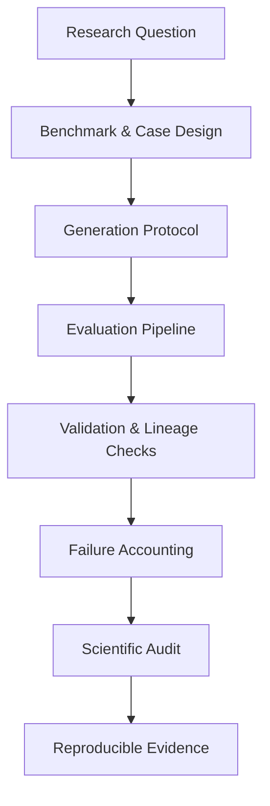

<div align="center">


[](https://git.io/typing-svg)

**Research-oriented student building reliable AI systems and studying how modern generative models fail, generalize, and interact with real-world environments.**


</div>

---

<div align="center">

# 🎧 Flagship Research — AudiobookBench-CN

## **A Research-Centered Benchmark for Long-Form Chinese TTS Evaluation**


</div>

> ### **AudiobookBench-CN is my current flagship research project.**
> It focuses on **long-form Chinese text-to-speech evaluation** under **controlled, reproducible, and audit-friendly** experimental protocols.

<table>
<tr>
<td width="33%" valign="top">

### 🔍 Core Question

How should long-form TTS systems be evaluated when **demo quality alone is not enough**?

</td>
<td width="33%" valign="top">

### 🧱 Core Idea

Treat evaluation as a **research system**: benchmark design, execution discipline, validation, and scientific audit all matter.

</td>
<td width="33%" valign="top">

### 🎯 Long-Term Value

A foundation for future work in **TTS evaluation**, **speech reliability**, **forensics**, and **AI security**.

</td>
</tr>
</table>

### 🌟 Research Spotlight

| Dimension | AudiobookBench-CN focus |
|---|---|
| **Task** | Long-form Chinese audiobook-style TTS |
| **Research Goal** | Reliable and reproducible evaluation |
| **Experimental Style** | Controlled protocols instead of ad-hoc demos |
| **Evidence** | Structured outputs, provenance and validation |
| **Failure Handling** | Failures are accounted for rather than hidden |
| **Long-term Value** | Foundation for TTS evaluation, reliability and security research |

### 🧠 Why this project matters

- **Benchmark-oriented**, not just demo-oriented
- **Evaluation-first**, not presentation-first
- **Failure-aware**, not failure-hiding
- **Research-auditable**, not loosely documented
- **Useful as a bridge** from speech generation to reliability and security research

### ⚙️ Research pipeline



<table>
<tr>
<td width="50%" valign="top">

### 🧪 Research principles

- **Reproducibility first** — settings, assets, cases, and outputs should be traceable
- **Failures are evidence** — infrastructure and scientific failures should be recorded
- **Evaluation before presentation** — a nice demo is not a substitute for a controlled experiment
- **Reviewability matters** — results should be understandable and independently inspectable

</td>
<td width="50%" valign="top">

### 🧭 Connected directions

AudiobookBench-CN sits at the intersection of:

- **Speech / TTS systems**
- **AI reliability**
- **evaluation methodology**
- **synthetic speech analysis**
- **speech forensics**
- **AI security for generative audio**

</td>
</tr>
</table>

<div align="center">

`Speech` · `TTS` · `Long-form Generation` · `Benchmarking` · `Evaluation` · `Reproducibility` · `Auditability` · `AI Reliability` · `Forensics`

### 🔬 Status: Active Research

</div>

---

## 🔬 Research Interests

<table>
<tr>
<td width="50%" valign="top">

### 🛡️ AI Security

- Robustness of AI systems
- Open-set / OOD evaluation
- Generative AI security
- Reliability and failure analysis

</td>
<td width="50%" valign="top">

### 🎙️ Speech & TTS

- Long-form speech generation
- TTS evaluation
- Synthetic speech forensics
- Robust audio intelligence

</td>
</tr>
<tr>
<td width="50%" valign="top">

### 🧠 LLM Systems

- LLM evaluation
- Context & memory systems
- Protocol interoperability
- Reproducible AI experiments

</td>
<td width="50%" valign="top">

### 🔧 Agents & MCP

- Tool-augmented agents
- MCP-based systems
- Multi-step research workflows
- Agent safety and tool boundaries

</td>
</tr>
</table>

---

# 🚀 Selected Engineering & Research Projects

## 🔄 Protocol Converter

> **OpenAI-style ↔ Anthropic-style protocol translation through a unified intermediate representation.**

A systems-oriented project exploring protocol interoperability, stateful conversations, memory injection, gateway design, and KV-cache observability.

**Highlights**

- Unified intermediate representation
- OpenAI Chat / Responses / Anthropic adapters
- Stateful conversation layer
- Memory injection
- KV-cache observability
- HTTP gateway and streaming support
- Automated tests

[**View Repository →**](https://github.com/XuWenboooo/-OpenAI-)

`Python` `LLM Systems` `API Gateway` `Caching` `Evaluation`

---

## 📄 Paper Reading Assistant

> **An evaluation-driven LLM system for academic paper understanding.**

Instead of building only a paper-chat demo, this project includes a six-dimensional evaluation framework for measuring answer quality.

**Evaluation dimensions**

`Factual Accuracy` · `Citation Accuracy` · `Terminology Correctness` · `Completeness` · `Comprehensibility` · `Safety Compliance`

**Components**

- PDF / DOCX / Markdown parsing
- LLM-based question answering
- Synthetic evaluation dataset construction
- LLM-as-Judge evaluation
- Rule-based validation

[**View Repository →**](https://github.com/XuWenboooo/paper-reading-assistant)

`LLM` `Evaluation` `Academic AI` `Research Tools`

---

## 🧰 MCP Research Assistant

> **A multi-tool research assistant built around the Model Context Protocol.**

A modular MCP system combining document processing, search, analysis, knowledge retrieval, and multi-step tool workflows.

**Focus**

- Document processing
- Search and retrieval
- Tool orchestration
- Multi-step workflows
- Agent / tool boundaries

[**View Repository →**](https://github.com/XuWenboooo/mcp-tool-assistant)

`MCP` `Agents` `Tool Use` `Research Automation`

---

# 🧭 Current Research Direction

```text
LLM Systems
     │
     ├── Evaluation & Reliability
     │
     ├── Agent / MCP Systems
     │
     └── AI Security
              │
              └── Speech / TTS Security
                       │
                       └── Robust Evaluation & Forensics
```

My goal is to connect **AI systems engineering** with **security, evaluation, and speech intelligence** into a coherent research direction.

---

# 🧪 How I Work

I care not only about whether a system works, but also whether:

- the result is **reproducible**
- the evaluation protocol is **well-defined**
- failures are **recorded instead of hidden**
- conclusions are supported by **actual experiments**
- engineering decisions can survive **independent review**

```text
Question
   ↓
Hypothesis
   ↓
Experimental Protocol
   ↓
Implementation
   ↓
Evaluation
   ↓
Failure Analysis
   ↓
Reproducible Evidence
```

---

# 🛠️ Tech Stack

<div align="center">

[](https://skillicons.dev)

</div>

<div align="center">

`Python` · `C++` · `PyTorch` · `Git` · `GitHub` · `LLM APIs` · `MCP` · `Speech / Audio Evaluation`

</div>

---

# 📊 GitHub

<div align="center">


</div>

---

# 🌱 Currently

- 🔬 Working on **long-form TTS evaluation**
- 🛡️ Exploring **AI Security and synthetic speech forensics**
- 🧠 Studying **LLM evaluation and reliable AI systems**
- 🔧 Improving engineering practices around **testing, CI and reproducibility**

---

# 📫 Contact

If you are interested in my research or projects, feel free to contact me through GitHub.

<div align="center">

### Research · Build · Evaluate · Understand


</div>
